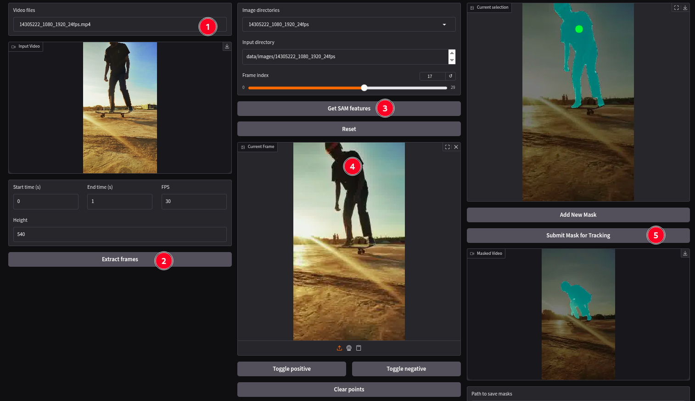

# SAM2 GUI

A user-friendly graphical interface for **Segment Anything Model 2 (SAM2)** video object segmentation and tracking.

## 📦 Getting Started

### Prerequisites

* Python ≥ 3.10
* Git
* CUDA-compatible GPU (recommended for faster inference)

### Clone & Setup

```bash
git clone https://github.com/realsanjeev/sam2-gui.git
cd sam2-gui

# Create virtual environment
python3 -m venv venv
source venv/bin/activate  # Windows: venv\Scripts\activate

# Install dependencies
pip install -r requirements.txt
```

### Install SAM2 with Checkpoints

```bash
# Clone SAM2 repo (shallow clone)
git clone --depth=1 https://github.com/facebookresearch/segment-anything-2.git sam2

# Install in editable mode
cd sam2
pip install -e . --quiet

# Download pre-trained checkpoints
cd checkpoints
./download_ckpts.sh > /dev/null 2>&1
cd ..

# Move GUI app inside sam2 dir
mv ../video_tracker.py .
```

> **Quick Test**: Run the [Google Colab Notebook](https://colab.research.google.com/github/realsanjeev/sam2-gui/notebooks/SAM2.1-for-video-tracking.ipynb) to tinker with SAM2 Video tracking.

---

## 🗂️ Data Folder Structure

Create a folder `data` and Organize your data folder structure like this like this:

```
sam2/
└── video_tracker.py         # GUI application
└── data/
    ├── videos/         # Input videos
    │   ├── seq1.mp4
    │   └── seq2.mp4
    ├── images/         # Auto-extracted frames (generated at runtime)
    └── masks/          # Output: tracked masks & blended videos
```

---

## ▶️ Usage

### Launch the GUI

```bash
python video_tracker.py --root_dir data
```

### View All Options

```bash
python video_tracker.py --help
```

---

## 🖥️ Interface Preview



## ⚙️ Advanced Tips

* Use **positive/negative clicks** to refine segmentation
* Enable **TF32** on Ampere GPUs for faster inference:

```python
import torch
torch.backends.cuda.matmul.allow_tf32 = True
```

* Learn about alpha blending: [Wikipedia: Alpha Compositing](https://en.wikipedia.org/wiki/Alpha_compositing)


## 🚀 Features

* Point-and-click segmentation on video frames
* Real-time mask propagation across frames
* Export segmented masks and overlaid videos
* Built with **Gradio** for an intuitive web-based interface
* Supports custom video inputs


## 📚 References

* [SAM2 Official Repository](https://github.com/facebookresearch/segment-anything-2)
* [PyTorch TF32 on Ampere GPUs](https://pytorch.org/docs/stable/notes/cuda.html#tensorfloat-32-tf32-on-ampere-devices)
* [Alpha Blending - Wikipedia](https://en.wikipedia.org/wiki/Alpha_compositing)
* [Video courtesy of Pexels.com](https://www.pexels.com/video/dynamic-skateboarding-tricks-at-sunset-33670184/)

---

Built with ❤️ for the computer vision community.
